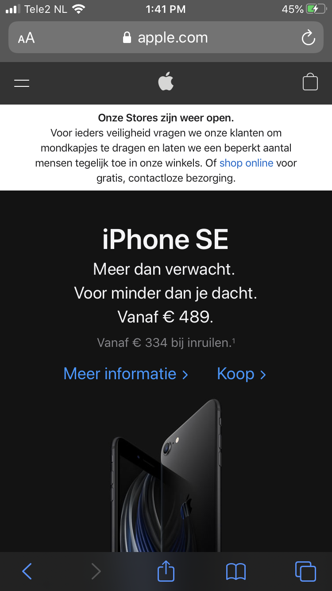
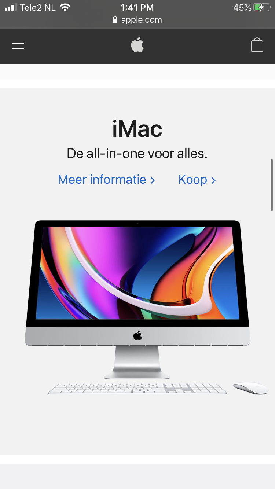
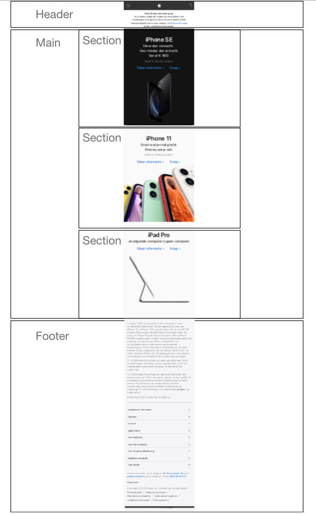
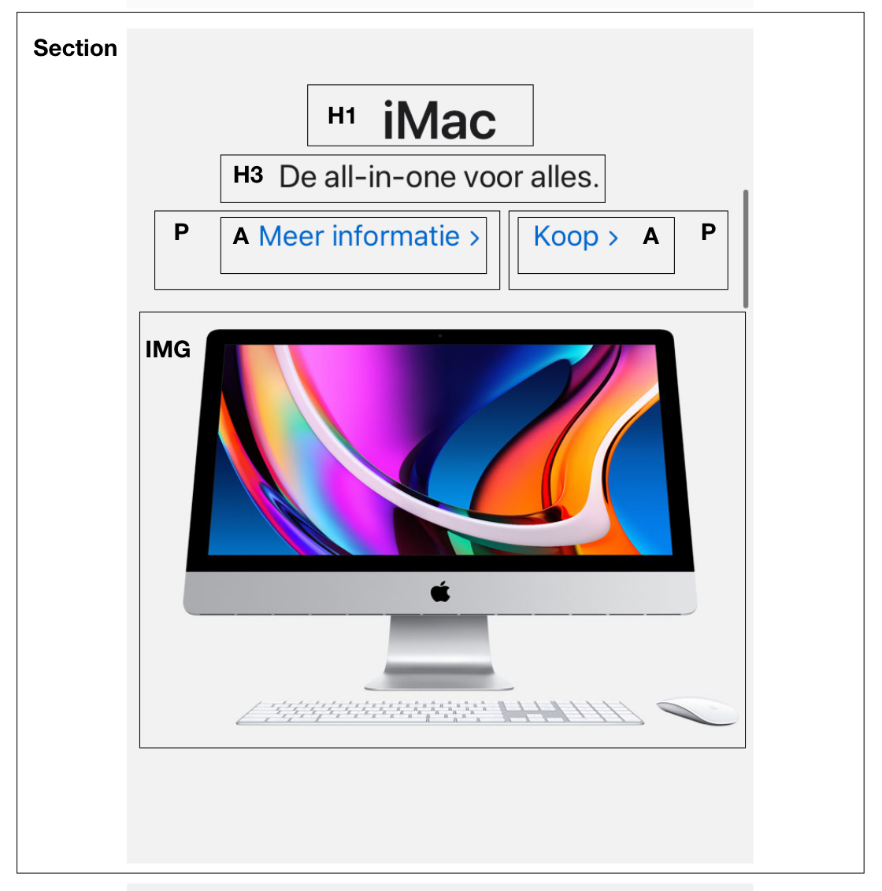

# Procesverslag
**Auteur:** -Fabian Guerra Avila-

Markdown cheat cheet: [Hulp bij het schrijven van Markdown](https://github.com/adam-p/markdown-here/wiki/Markdown-Cheatsheet). Nb. de standaardstructuur en de spartaanse opmaak zijn helemaal prima. Het gaat om de inhoud van je procesverslag. Besteedt de tijd voor pracht en praal aan je website.

## Bronnenlijst
1. -bron 1-
2. -bron 2-
3. -...-

## Eindgesprek (week 7/8)

-dit ging goed & dit was lastig-

**Screenshot(s):**

-screenshot(s) van je eindresultaat-

## Voortgang 3 (week 6)

-same as voortgang 1-

## Voortgang 2 (week 5)

-same as voortgang 1-

## Voortgang 1 (week 3)

### Stand van zaken

-dit ging goed & dit was lastig-

**Screenshot(s):**

-screenshot(s) van hoe ver je bent-

### Agenda voor meeting

-samen met je groepje opstellen-

### Verslag van meeting

-na afloop snel uitkomsten vastleggen-

## Intake (week 1)

**Je startniveau:** -Ik kies als uitdaging de rode piste. Ik heb het gevoel dat ik nog ergens tussen blauw en rood in zit, maar als ik goed m'n best doe moet rood lukken!-

**Je focus:** -Ik ga extra aandacht besteden aan de surface laag. Maar hier kan ik me later nog over bedenken.-

**Je opdracht:** -(https://www.apple.com "Apple website") Ik wil graag de Apple website namaken omdat ik vind dat het mooi is opgemaakt en ik dat ook zo goed wil kunnen.-

**Screenshot(s):**

 
  

**Breakdown-schets(en):**

